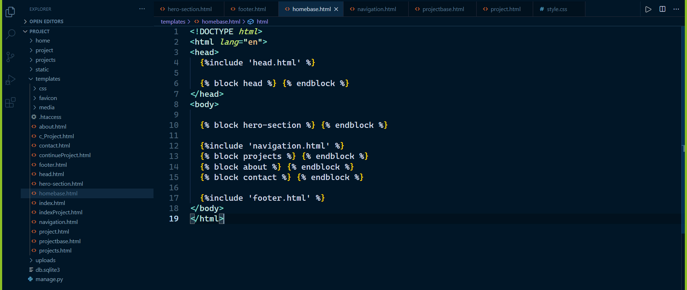
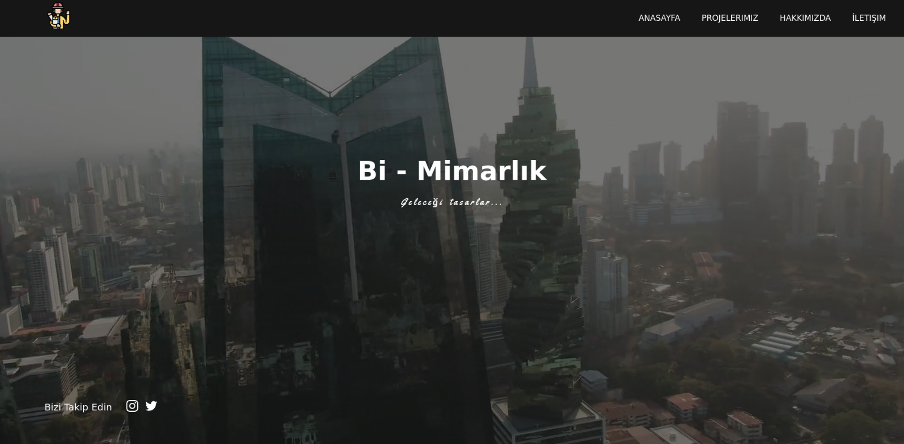

[GitHub Link](https://github.com/BerkeBaykondu/Bi-Mimarlik-Proje)

## Model Samples

```javascript
class About(models.Model):
  STATUS = (
    ('True', 'Evet'),
    ('False', 'Hayır'),
  ) # açılan combobox tan gelecek. status combobox tan beslenecek
  icon = models.ImageField(blank=True, upload_to='images/')
  svg = models.TextField(blank=True, verbose_name='SVG')
  title = models.CharField(max_length=100, verbose_name='title')
  description = models.TextField(verbose_name='description')
  status = models.CharField(max_length=10, choices = STATUS)
  create_at = models.DateTimeField(auto_now_add = True)
  update_at = models.DateTimeField(auto_now = True)

  def _str_(self):
    return self.title
```
``````javascript
class Settings(models.Model):
  logo = models.ImageField(blank=True, upload_to='images/')
  companyName = models.CharField(blank=True,max_length=100,verbose_name='Company Name')
  slogan = models.CharField(blank=True,max_length=100,verbose_name='Slogan')
  instagram = models.CharField(blank=True,max_length=255,verbose_name='Instagram')
  twitter = models.CharField(blank=True,max_length=255, verbose_name='Twitter')
  linkedin = models.CharField(blank=True,max_length=255, verbose_name='Linkedin')
  email = models.CharField(blank=True,max_length=150, verbose_name='Email')
  address = models.CharField(blank=True,max_length=150, verbose_name='Address')
  phone = models.CharField(blank=True,max_length=15, verbose_name='Phone')
  phone2 = models.CharField(blank=True,max_length=15, verbose_name='Phone 2')
  maps = models.CharField(blank=True,max_length=15, verbose_name='Map')
  def __str__(self):
    return self.companyName
``````

---


## View Samples

```javascript
from django.shortcuts import render,HttpResponse

# Create your views here.
from home.models import Settings, About

def index(request):
  settings = Settings.objects.get(pk = 1)
  about = About.objects.all().filter(status = True)
  
  context = {'setting': settings, 'about': about}

  return render(request, 'index.html', context)
```
```javascript
from django.shortcuts import render,HttpResponse
from home.models import Settings
from projects.models import Projects

def project(request):
  settings = Settings.objects.get(pk = 1)
  projects = Projects.objects.all().filter(status = True)
  
  context = {'setting': settings, 'project': project, 'projects': projects}

  return render(request, 'indexProject.html', context)

def continueProject(request):
  settings = Settings.objects.get(pk = 1)
  
  projects = Projects.objects.all().filter(status = False)
  
  context = {'setting': settings, 'projects': projects}

  return render(request, 'continueProject.html', context)
```

---

## Template Samples

	


